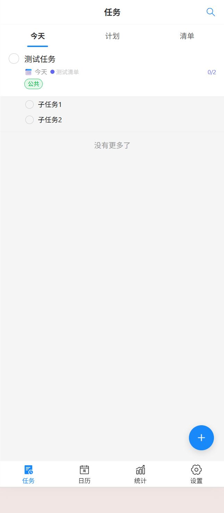
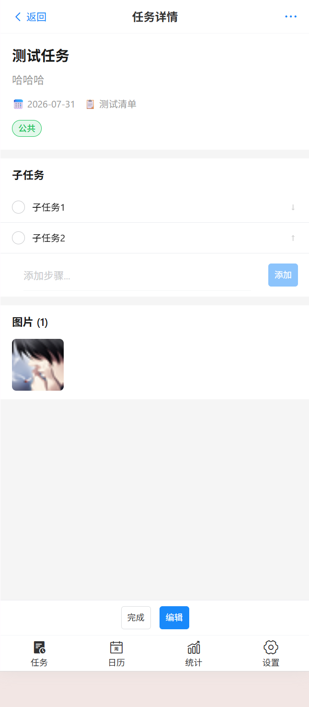
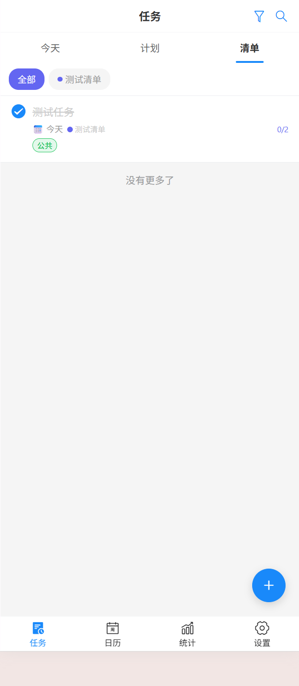
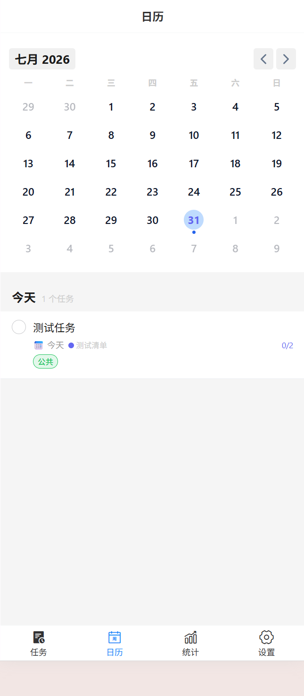
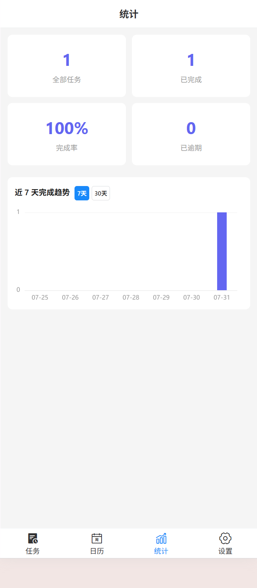
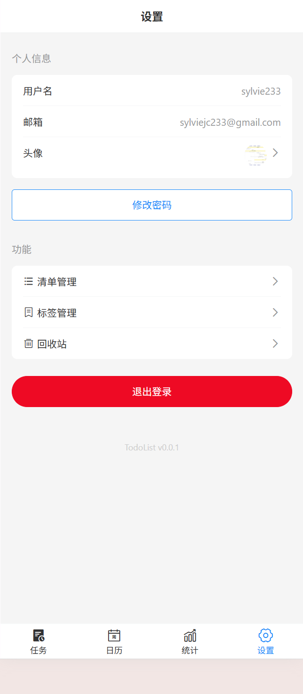

# 📋 TodoList

全栈移动端待办事项管理应用，基于 Vue 3 + NestJS + PostgreSQL Monorepo 架构。

## 技术栈

| 层 | 技术 |
|:---:|:---|
| 前端 | Vue 3 + Vite + Vant 4 + Pinia + ECharts + v-calendar |
| 后端 | NestJS + Drizzle ORM + JWT + Winston + MinIO |
| 数据库 | PostgreSQL 15 |
| 存储 | MinIO（对象存储） |
| 包管理 | pnpm + Turborepo |
| 语言 | TypeScript（严格模式） |
| 部署 | Docker + Docker Compose |

## 项目预览

| 登录 | 注册 | 今日任务 |
|:------:|:------:|:------:|
|  |  |  |

| 任务详情 | 清单管理 | 日历视图 |
|:------:|:------:|:------:|
|  |  |  |

| 统计看板 | 回收站 | 个人设置 |
|:------:|:------:|:------:|
|  |  |  |

## 功能模块

| 模块 | 说明 |
|:---:|:---|
| 任务管理 | 创建/编辑/删除/完成，优先级、截止日期、置顶、拖拽排序 |
| 今日视图 | 今日截止 + 已逾期任务汇总 |
| 计划视图 | 按日期分组：逾期/今天/明天/本周/更晚 |
| 清单管理 | 自定义清单分组，颜色标识，横向快速切换 |
| 标签管理 | 自定义标签，多对多绑定，颜色区分 |
| 子任务 | 任务拆解步骤，排序、展开/收起 |
| 图片附件 | MinIO 存储，任务详情预览、编辑页上传管理 |
| 日历视图 | v-calendar 月份网格，日期圆点标记，按日筛选 |
| 搜索 | 标题/描述全文搜索，搜索历史，高级筛选（状态/优先级/标签）|
| 统计看板 | ECharts 图表：KPI 卡片 + 7天柱状/30天折线趋势 + 逾期汇总 |
| 回收站 | 软删除，支持恢复，永久删除 |
| 用户系统 | 注册/登录，JWT 双 token 认证，静默刷新 |
| 头像 | 裁剪上传，MinIO 存储 |
| 提醒 | 单次/重复提醒，支持 cron 自定义周期 |

## 快速开始

### 本地开发

```bash
# 1. 启动 PostgreSQL + MinIO
docker compose -f scripts/docker-compose.yml up -d postgres minio

# 2. 安装依赖
cd web && pnpm install

# 3. 初始化数据库
pnpm --filter server db:migrate
# 或手动执行 scripts/init.sql

# 4. 创建 .env
cp web/.env.example web/server/.env

# 5. 启动开发环境
pnpm dev
```

前端 `http://localhost:5173` | 后端 `http://localhost:3000/api/v1/` | MinIO `http://localhost:9001`

### Docker 部署

```bash
docker compose -f scripts/docker-compose.yml up -d
```

### 项目结构

```
TodoList/
├── web/                        # Monorepo 应用代码
│   ├── client/                 # 前端 —— Vue 3 + Vite + Vant
│   ├── server/                 # 后端 —— NestJS + Drizzle
│   ├── shared/                 # 前后端共享类型
│   └── turbo.json              # Turborepo 构建管线
├── scripts/                    # Docker + 初始化 SQL
├── doc/                        # 文档
└── CLAUDE.md                   # 项目开发规范
```

## License

MIT
