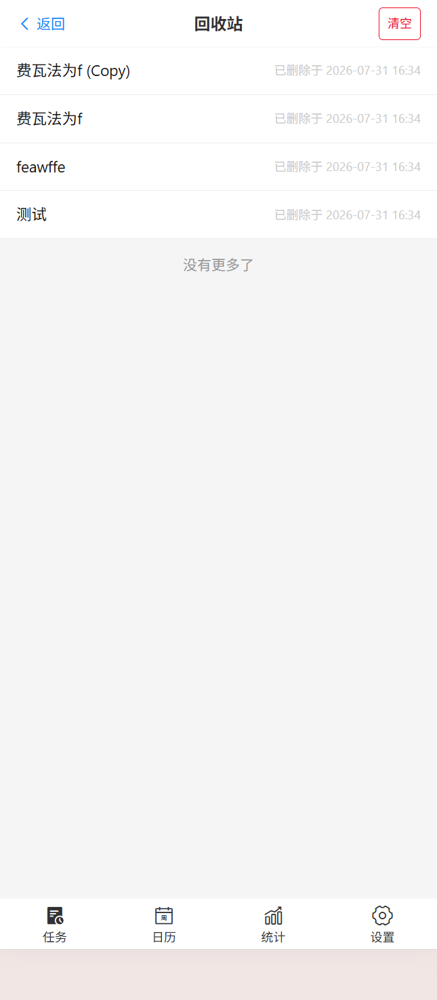

# 📋 TodoList

全栈移动端待办事项管理应用，支持 **Web（Vue 3）** 和 **Flutter 原生** 双客户端，共享同一 NestJS 后端。

## 技术栈

| 层 | 技术 |
|:---:|:---|
| Web 前端 | Vue 3 + Vite + Vant 4 + Pinia + ECharts + v-calendar |
| Flutter 客户端 | Flutter 3.44 + Dio + table_calendar + fl_chart + image_picker |
| 后端 | NestJS + Drizzle ORM + JWT + Winston + MinIO |
| 数据库 | PostgreSQL 15 |
| 存储 | MinIO（对象存储） |
| 包管理 | pnpm + Turborepo（Web）/ pub（Flutter） |
| 语言 | TypeScript（严格模式）/ Dart |
| 部署 | Docker + Docker Compose |

## 项目预览（Web）

| 登录 | 注册 | 今日任务 |
|:------:|:------:|:------:|
|  |  |  |

| 任务详情 | 清单管理 | 日历视图 |
|:------:|:------:|:------:|
|  |  |  |

| 统计看板 | 个人设置 | 回收站 |
|:------:|:------:|:------:|
|  |  |  |

## 功能模块

| 模块 | Web | Flutter | 说明 |
|:---:|:---:|:---:|:---|
| 任务管理 | ✅ | ✅ | 创建/编辑/删除/完成，优先级、截止日期 |
| 今日视图 | ✅ | ✅ | 今日截止 + 已逾期任务汇总 |
| 计划视图 | ✅ | ✅ | 所有有截止日期的任务 |
| 清单管理 | ✅ | ✅ | 自定义清单分组，颜色标识 |
| 标签管理 | ✅ | ✅ | 自定义标签，多对多绑定，颜色选择 |
| 子任务 | ✅ | ✅ | 任务拆解步骤，排序、展开/收起 |
| 图片附件 | ✅ | ✅ | MinIO 存储，多图上传/预览 |
| 日历视图 | ✅ | ✅ | 月份网格，日期任务标记，按日查看 |
| 搜索 | ✅ | — | 全文搜索 + 搜索历史 |
| 统计看板 | ✅ | ✅ | KPI 卡片 + 趋势图表 + 逾期汇总 |
| 回收站 | ✅ | ✅ | 软删除恢复 + 永久删除 |
| 用户系统 | ✅ | ✅ | 注册/登录，JWT 双 token，静默刷新 |

## 快速开始

### Web 开发

```bash
# 1. 启动 PostgreSQL + MinIO
docker compose -f scripts/docker-compose.yml up -d postgres minio

# 2. 安装依赖
cd web && pnpm install

# 3. 初始化数据库
pnpm --filter server db:migrate

# 4. 创建 .env
cp web/.env.example web/server/.env

# 5. 启动
pnpm dev
```

Web `http://localhost:5173` | API `http://localhost:3000/api/v1/` | MinIO `http://localhost:9001`

### Flutter 开发

```bash
cd app
flutter pub get

# 修改 lib/config/api_config.dart 中的 baseUrl 为你的后端地址
# Android 模拟器: http://10.0.2.2:3000/api/v1
# 真机/iOS 模拟器: http://<你的IP>:3000/api/v1
# Web: http://localhost:3000/api/v1

# Web 模式
flutter run -d chrome

# Android/iOS
flutter run
```

> Flutter Web 模式需后端 CORS 配置 `origin: true`（已默认开启）。

### Docker 部署

```bash
docker compose -f scripts/docker-compose.yml up -d
```

## 项目结构

```
TodoList/
├── web/                        # Web Monorepo
│   ├── client/                 # 前端 —— Vue 3 + Vite + Vant
│   ├── server/                 # 后端 —— NestJS + Drizzle（Web/Flutter 共享）
│   ├── shared/                 # 共享 TypeScript 类型
│   └── turbo.json
├── app/                        # Flutter 客户端
│   ├── lib/
│   │   ├── main.dart           # 入口 + 启动鉴权
│   │   ├── config/             # API 地址配置
│   │   ├── services/           # Dio 网络层（JWT 拦截 + 刷新）
│   │   ├── models/             # 数据模型
│   │   ├── pages/              # 12 个页面
│   │   └── widgets/            # 可复用组件（TaskCard）
│   └── pubspec.yaml
├── scripts/                    # Docker + init.sql
├── doc/                        # 文档 + 截图
└── CLAUDE.md
```

### Flutter 页面架构

| 页面 | 文件 | 说明 |
|------|------|------|
| 启动鉴权 | `main.dart` | 检查 Token → 登录页或主页 |
| 登录 | `login_page.dart` | 邮箱 + 密码 |
| 注册 | `register_page.dart` | 用户名 + 邮箱 + 密码 |
| 主页壳 | `home_page.dart` | IndexedStack + 底部 4 Tab 导航 |
| 任务列表 | `tasks_page.dart` | 今天/计划/清单 Tab + 分页 + FAB |
| 任务详情 | `task_detail_page.dart` | 子任务/图片/完成/删除 |
| 新建编辑 | `task_create_page.dart` | 标题/日期/优先级/标签/图片上传 |
| 日历 | `calendar_page.dart` | table_calendar 月历 + 日期任务 |
| 统计 | `statistics_page.dart` | fl_chart 图表 + KPI + 逾期 |
| 设置 | `settings_page.dart` | 个人信息 + 管理入口 + 退出 |
| 清单管理 | `list_page.dart` | 创建/删除清单 |
| 标签管理 | `tag_page.dart` | 创建/删除标签 + 颜色选择 |
| 回收站 | `recycle_bin_page.dart` | 滑动恢复/永久删除 |

## License

MIT
